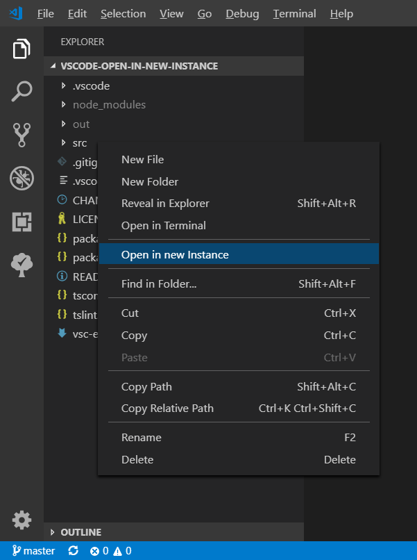

# Open in new Instance

This extension allows you to open a folder from the VSCode Explorer in a new Instance of VSCode from the VS Code Explorer context menu.

## Installation

Easily install this Extension by typing `ext install sydeslyde.open-in-new-instance` and pressing enter in the command bar.

## Configuration

There is a configuration item, to also show the context menu entry for files.  (Defaut is false)

`"openInNewInstance.alsoShowForFiles" = true`

## Lanuage Support

As of now, following languages are supported via the Visual Studio Codes Display Language setting:

- English (fallback)
- German